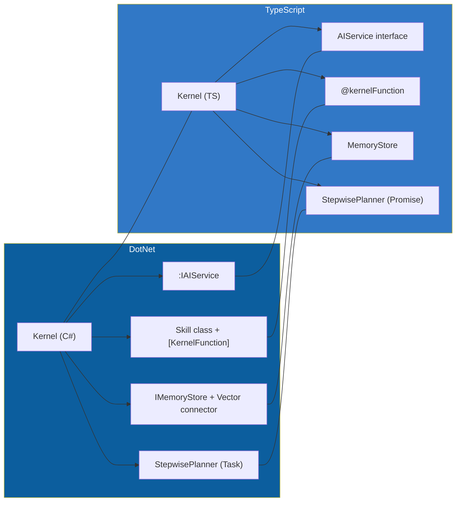

**Executive summary**

Microsoft Semantic Kernel’s original **.NET implementation** is a mature, highly-modular SDK that leans on the established `Microsoft.Extensions.*` ecosystem (dependency-injection, logging, configuration) and strongly-typed C# attributes to declare “skills,” “planners,” and memory connectors. The emerging **TypeScript port** inspired by that code base retains the same conceptual layers—Kernel, Services, Plugins, Memory, and Planner—but translates them into idiomatic Node patterns: decorators instead of attributes, async/await instead of Tasks, npm workspaces rather than multi-targeted NuGet packages, and lightweight inversion-of-control via factory functions (with optional Inversify). Architecturally, the two stacks stay remarkably close at the public API level, yet they diverge in runtime model, build pipeline, and extensibility points. The diagram below maps the one-to-one and one-to-many relationships between the layers, highlighting where the TypeScript version compresses or re-implements .NET abstractions to fit the JavaScript ecosystem.

---

## 1  Scope & methodology

This comparison focuses on **structure and architecture**, not language syntax. It is based on public documentation, code-level inspection of the Microsoft Learn articles for .NET SK and the community JavaScript docs at *kerneljs.com*, plus the recent PR “Added a TypeScript version of Semantic Kernel” opened by @atveit in the upstream repo. ([learn.microsoft.com][1], [kerneljs.com][2], [github.com][3])

---

## 2  Core abstraction: the Kernel

| Concern       | .NET SK (`Kernel`)                                                                                     | TypeScript SK (`Kernel`)                                                                              |
| ------------- | ------------------------------------------------------------------------------------------------------ | ----------------------------------------------------------------------------------------------------- |
| Lifetime      | Built from a `KernelBuilder` that plugs `IAIService`, memory, telemetry via Microsoft DI               | Similar builder pattern returns a plain JS object; DI optional, services passed as constructor args   |
| Extensibility | Attributes (`[KernelFunction]`, `[KernelPlugin]`) discovered via reflection ([learn.microsoft.com][4]) | Decorators (`@kernelFunction`) compiled to metadata or explicit registration list ([kerneljs.com][2]) |
| Threading     | `Task`/`ValueTask` for async IO                                                                        | Native `Promise`/`async ↔ await`                                                                      |

---

## 3  Layer-by-layer comparison

### 3.1 Services & AI connectors

* **.NET** ships first-party packages for Azure OpenAI, OpenAI, Qdrant, and Pinecone as isolated NuGet libraries ([learn.microsoft.com][5]).
* **TypeScript** exposes matching connectors under `/integrations` using fetch-based adapters; fewer stores today but identical interface names for future parity. ([kerneljs.com][2])

### 3.2 Plugins (aka Skills)

Both editions adopt a *function-calling* contract: a JSON schema + description string. In C#, this is emitted from attributes; in TS, decorators compile to the same schema at build time. ([learn.microsoft.com][4], [kerneljs.com][2])

### 3.3 Memory

* **.NET**: `IMemoryStore`, `MemoryRecord`, vector connectors packaged separately and injected. ([learn.microsoft.com][5])
* **TS**: single `memory` folder with pluggable store interface; adapter pattern mirrors .NET but uses generics constrained by `Embedding<TVector>`. ([kerneljs.com][2])

### 3.4 Planning / Agents

Planners in .NET are shipped as `Microsoft.SemanticKernel.Planners.*` and rely on reflection to discover eligible steps ([learn.microsoft.com][6]).
The TS port offers `StepwisePlanner` that exports a `plan()` returning an array of callable plugin handles—same algorithm, rewritten in TS with async iterators. ([kerneljs.com][2])

---

## 4  Dependency-injection & configuration

* **.NET**: `KernelBuilder` extends `IServiceCollection`; benefits from scoping, lifetime control, and logging pipelines provided by `Microsoft.Extensions.DependencyInjection`. ([learn.microsoft.com][7])
* **TS**: no baked-in DI; developers pass services directly or integrate a community IoC container (e.g., Inversify) via factory wrappers—simpler but less opinionated. ([github.com][8])

---

## 5  Build & packaging

| Aspect           | .NET                                                                  | TypeScript                                                                    |
| ---------------- | --------------------------------------------------------------------- | ----------------------------------------------------------------------------- |
| Package registry | NuGet (`Microsoft.SemanticKernel`, split by feature) ([nuget.org][9]) | npm (`@semantic-kernel/core`, `@semantic-kernel/plugins` planned)             |
| Versioning       | SemVer; cross-language contracts kept via API review process          | Follows C# namespace map but releases behind by 1-2 minor versions            |
| Tooling          | MSBuild, analyzers, Roslyn source-gen for attribute processing        | `tsup` or `tsc --build` monorepo, decorators transpiled via TypeScript 5 emit |

---

## 6  Performance & concurrency

* **.NET**: Parallel skill invocation uses `ValueTask.WhenAll`; ASP.NET minimal-API samples demonstrate streaming SSE. ([techcommunity.microsoft.com][10])
* **TS**: Relies on Node event loop; kernel functions marked `async` run concurrently with `Promise.all`, but long-running LLM calls may saturate single-thread unless worker threads are used. ([linkedin.com][11])

---

## 7  Ecosystem health

* .NET SK is production-ready (v1.1-LTS) with >25 k GitHub stars and weekly NuGet downloads. ([github.com][12])
* TS port is **early-stage**—the PR from June 2025 has not yet been merged; community doc site `kerneljs.com` fills the gap while parity work continues. ([github.com][3], [kerneljs.com][13])

---

## 8  Visualisation: layer mapping

The horizontal dashed lines show conceptual equivalence; thicker blocks in the .NET cluster indicate additional infrastructure (DI, logging scopes) that the TypeScript version currently handles manually.

---

## 9  Key take-aways for researchers

1. **API-surface parity > 80 %** – naming, folder structure, and docstrings intentionally match to ease multi-language samples.
2. **Runtime divergence matters** – C# async/await over multi-threaded CLR vs Node’s single-thread event loop affects throughput designs.
3. **Extensibility trade-off** – C# reflection + attributes delivers auto-discovery; TS favors explicit registration for bundle-size and tree-shaking friendliness.
4. **Ecosystem maturity gap** – NuGet packages integrate with Microsoft.Extensions out-of-the-box; npm equivalents are still in preview.
5. **Interoperability path** – JSON-schema-based function descriptors mean planners written in TS can orchestrate C# plugins (and vice-versa) over RPC, opening polyglot agent patterns.

---

## 10  Further reading & next steps

* Microsoft Learn **“Understanding the kernel”** for .NET and equivalent JS doc pages. ([learn.microsoft.com][7], [kerneljs.com][2])
* The **Qdrant connector** tutorial demonstrates a full memory integration pipeline on .NET that is slated for TS parity. ([learn.microsoft.com][5])
* Track the PR **#12421** for ongoing TypeScript port progress and test coverage. ([github.com][3])

---

> **Suggested experiment**
> Clone both sub-trees, run `dotnet test` in `/dotnet` and `npm run test` in `/ts`, then profile planner execution under load. Compare throughput to validate the concurrency considerations highlighted above.

[1]: https://learn.microsoft.com/en-us/semantic-kernel/overview/?utm_source=chatgpt.com "Introduction to Semantic Kernel | Microsoft Learn"
[2]: https://kerneljs.com/concepts/kernel "Understanding the kernel - Semantic Kernel for JavaScript"
[3]: https://github.com/microsoft/semantic-kernel/pull/12421?utm_source=chatgpt.com "Added a typescript version of Semantic Kernel #12421 - GitHub"
[4]: https://learn.microsoft.com/en-us/semantic-kernel/concepts/plugins/?utm_source=chatgpt.com "Plugins in Semantic Kernel | Microsoft Learn"
[5]: https://learn.microsoft.com/en-us/semantic-kernel/concepts/vector-store-connectors/out-of-the-box-connectors/qdrant-connector?utm_source=chatgpt.com "Using the Semantic Kernel Qdrant Vector Store connector (Preview)"
[6]: https://learn.microsoft.com/en-us/semantic-kernel/concepts/planning?utm_source=chatgpt.com "What are Planners in Semantic Kernel | Microsoft Learn"
[7]: https://learn.microsoft.com/en-us/semantic-kernel/concepts/kernel?utm_source=chatgpt.com "Understanding the kernel in Semantic Kernel | Microsoft Learn"
[8]: https://github.com/microsoft/semantic-kernel/issues/334?utm_source=chatgpt.com "microsoft/semantic-kernel - TypeScript support (~C# parity) - GitHub"
[9]: https://www.nuget.org/packages/Microsoft.SemanticKernel.Connectors.AzureOpenAI/?utm_source=chatgpt.com "Microsoft.SemanticKernel.Connectors.AzureOpenAI 1.56.0 - NuGet"
[10]: https://techcommunity.microsoft.com/blog/healthcareandlifesciencesblog/create-a-semantic-kernel-service-using-minimal-api/3872427?utm_source=chatgpt.com "Create a Semantic Kernel service using minimal API"
[11]: https://www.linkedin.com/pulse/building-ai-reasoning-pane-nodejs-c-semantic-kernel-stack-swider-xhrfe?utm_source=chatgpt.com "Building an AI Reasoning Pane in a Node.js + C# Semantic Kernel ..."
[12]: https://github.com/microsoft/semantic-kernel?utm_source=chatgpt.com "microsoft/semantic-kernel: Integrate cutting-edge LLM ... - GitHub"
[13]: https://kerneljs.com/ "Semantic Kernel for JavaScript"
